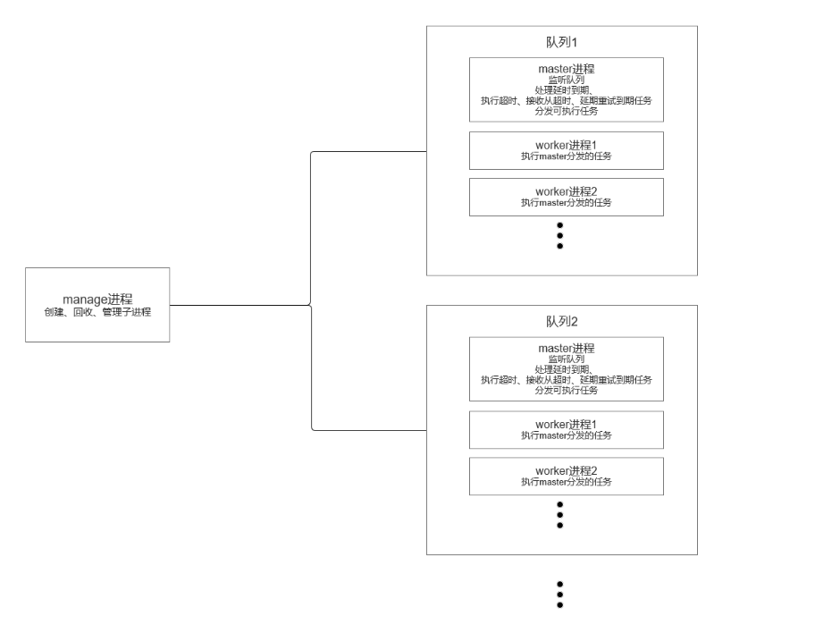

# multi-process-queue

基于swoole的多进程队列系统，manage进程管理子进程，master进程监听队列分发任务，worker进程执行任务，
多进程、低延时(最低毫秒级)、低资源占用、高可用、可多服务器分布式部署。可与 laravel thinkphp 等框架配合使用。

版本要求：

 - php>=7.1
 - swoole >= 4.4

当前支持的驱动 
 - redis （redis版本需大于3.0.2,redis扩展版本建议>=4.0.0）

### 特性
 - 最低毫秒级任务延时
 - 自定义重试次数和错误回调
 - 自定义超时时间
 - 自定义启动预执行函数，方便初始化其他框架与其他项目配合使用
 - master协程监听队列降低延时
 - 多worker进程消费任务  
 - worker进程支持一键化协程
 - 支持后台守护运行,无需其余进程管理工具
 - 支持多服务器分布式部署
 - 高可用，根据超时时间判断，确保进程挂掉后,回调函数执行成功。

### 进程结构图



### 配置说明

| 配置项 | 类型 | 是否必填 | 默认值 | 说明 |
| --- | --- | --- | --- | --- |
| basics | array | 是 | 无 | 基础配置项 |
| basics.name | string | 是 | 无 | 当前队列服务名称,多个服务同时启动时需要分别设置名字(名字自定义确保队列服务名字不重复即可) |
| basics.pid_path | string | 否 | /tmp | 主进程pid文件存放路径 |
| basics.driver | string | 是 | 无 | 队列驱动必须是MPQueue\Queue\Driver\DriverInterface的实现类 |
| worker_start_handle | callable | 否 | 空字符串 |worker进程启动后会调用(当前服务所有队列有效) |
| log | array | 是 | 无 | 日志配置 | 
| log.path | string | 否 | /tmp | 日志存放路径 | 
| log.level | int | 否 | Monolog\Logger::INFO |日志记录级别 Monolog\Logger::DEBUG/Monolog\Logger::INFO |
| log.dirver | string/class | 否 | RotatingFileLogDriver | 日志驱动，必须是MPQueue\Log\Driver\LogDriverInterface的实现 |
| queue | 二维数组 | 是 | 无 | 队列配置 |
|queue[0].name | string | 是 | 无 |队列名称 | 
|queue[0].worker_number | int | 否 | 3 | 工作进程数量 |
|queue[0].memory_limit | int | 否 | 128 | 工作进程最大使用内存数(单位mb)(0无限制)|
|queue[0].sleep_seconds | floot | 否 | 1 | 监视进程休眠时间（秒，最小到0.001） |
|queue[0].timeout | int | 否 | 120 | 超时时间(s)以投递任务方为准 |
|queue[0].fail_number | int | 否 | 3 | 最大失败次数以投递任务方为准,达到最大次数前(包括次数)失败后会重新投递(即任务最多允许执行fail_number+1次) |
|queue[0].fail_expire | int | 否 | 3 | 失败延时投递时间(s 支持小数精度到0.001)以投递任务方为准 |
|queue[0].fail_handle | callable | 否 | 空 | 任务失败执行函数(当任务超时或者达到最大投递次数后会执行) |
|queue[0].worker_start_handle | callable | 否 | 空 | worker进程启动加载函数（当前队列有效） |
|queue[0].model | int | 否 | \MPQueue\Config\QueueConfig::MODEl_DISTRIBUTE |队列运行模式（\MPQueue\Config\QueueConfig::MODEl_DISTRIBUTE 分发模式 \MPQueue\Config\QueueConfig::MODEL_GRAB 抢占模式）

fail_handle 会传入两个参数 $jobInfo 任务详细信息、$e出错的异常类
fail_handle的执行时间也受timeout的控制
#### 注意：任务超时后会直接记录为失败，不会根据fail_number进行失败重试,可以在fail_handle中根据$jobInfo['type']判断是否是超时任务。

#### 2.0改动
1. 取消超时回调，超时后记录为失败，触发失败回调。
2. 由原来的每次失败都触发失败回调改为，超时或超过失败重试次数后才触发。
3. 增加抢占模式:此模式下worker进程会主动抢任务会增加数据库查询和连接数量（1.0版本的模式为分发模式）
4. 增加高可用性，超时时间适用于失败回调，如果进程在失败回调执行期间挂掉，其余进程会在超时时间到达后再次执行失败回调。
5. 优化分发模式性能,按当前空闲进程数一次获取多个任务进行分发，qps大大提高。
### 下个版本规划
  - redis集群(Redis Cluster)支持

### 配置示例
```
[
    'basics'=>[
        'name'=>'mp-queue-1',//多个服务器同时启动时需要分别设置名字
        'driver'=> new \MPQueue\Queue\Driver\Redis('127.0.0.1'),
    ],
    'queue' => [
        [
            'name' => 'test',//队列名称
            'fail_handle'=>function(){
                var_dump('失败了');
            },//失败执行函数
        ],
        [
            'name' => 'test2',//队列名称
            'worker_number' => 4,//当前队列工作进程数量
            'memory_limit' => 0, //当前队列工作进程的最大使用内存，超出则重启。单位 MB
        ]
    ]
]
```

## 快速上手
 ### 1.安装
 - composer 安装
 ```
  composer require yuntian001/multi-process-queue
 ```
 - 或者直接下载压缩包 然后执行composer install
 ### 2. 启动队列
 - 新建 main.php
 ```
<?php
define('MP_QUEUE_CLI', true);
use MPQueue\Config\Config;
require_once __DIR__ . '/vendor/autoload.php';
$config = [
    'basics' => [
        'name' => 'mp-queue-1',//多个服务器同时启动时需要分别设置名字
        'driver' => new \MPQueue\Queue\Driver\Redis('127.0.0.1'),
    ],
    'queue' => [
        [
            'name' => 'test',//队列名称
            'fail_handle' => function () {
                var_dump('失败了');
            },//失败执行函数
        ],
        [
            'name' => 'test2',//队列名称
            'worker_number' => 4,//当前队列工作进程数量
            'memory_limit' => 0, //当前队列工作进程的最大使用内存，超出则重启。单位 MB
        ]
    ]
];
Config::set($config);
(new \MPQueue\Console\Application())->run();
 ```
 - 执行命令 worker:start 启动队列
 ```
    php master.php worker:start
 ```
 - 或者后台运行
 ```
   php master.php worker:start -d
 ``` 
 - 支持的命令（help命令可查看）
 ```
  php master.php help
```
```
  queue:clean 清空队列内容 --queue test 清空指定队列:test
  queue:status 查看队列信息 --queue test 指定队列:test
  queue:failed 打印失败信息详情 必须指定队列 --queue test 指定队列:test
  worker:start 启动 携带参数-d 后台启动
  worker:stop 停止
  worker:restart 重启 携带参数-d 后台启动
  worker:reload 平滑重启
  worker:status 查看进程运行状态
 ```
 ### 3. 投递任务
  - 执行以下代码投递任务（可web调用，调用进程无需加载swoole扩展）
```
    require_once __DIR__ . '/vendor/autoload.php';//require composer 加载文件 如果已加载则无需重复require
    $config = [
        'basics' => [
            'name' => 'mp-queue-1',//多个服务器同时启动时需要分别设置名字
            'driver' => new \MPQueue\Queue\Driver\Redis('127.0.0.1'),
        ],
        'queue' => [
            [
                'name' => 'test',//队列名称
                'fail_handle' => function () {
                    var_dump('失败了');
                },//失败执行函数
            ],
            [
                'name' => 'test2',//队列名称
                'worker_number' => 4,//当前队列工作进程数量
                'memory_limit' => 0, //当前队列工作进程的最大使用内存，超出则重启。单位 MB
            ]
        ]
    ];
     Config::set($config);
     $job = function(){
        var_dump('hello wordQ!');
     }
     MPQueue\Queue\Queue::push('test', $job,10);
```
MPQueue\Queue\Queue::push 接收三个参数：
- $queue 队列名称
- $job   投递的任务
 
  $job 允许的类型为callable 或 \MPQueue\Job的子类 具体测试可参考test文件夹
  
  $job为匿名函数时队列执行进程 和 投递任务进程无需再同一项目下。

  $job为静态方法/\MPQueue\Job的实现类/函数时 队列执行进程需要含有对应静态方法/\MPQueue\Job的实现类/函数。
  
  强烈建议投递$job使用\MPQueue\Job子类，子类中可自定义 超时时间、允许失败次数、延时重试时间、超时执行函数、失败执行函数。具体参数说明请进入[src/Job.php](src/Job.php)进行查看

- $delay 延时投递时间(s) 默认为0（立即投递）

任务投递示例，请参考test和test/Job文件夹下的normal.php、failed.php、timeout.php、pressure.php
## 注意事项
- worker:reload会让worker进程执行完当前任务后进程重启，worker:restart会暴力重启manage、master、worker进程，可能会造成任务执行一半被断掉。 
- 因进程是在启动后直接加载到内存中的，更改代码后不会立即生效 需要执行worker:reload 或者 worker:start使其生效。
- worker:reload 只会重启worker进程，不会重新加载配置文件，更改配置文件后需要worker:restart后才有效。

## 在laravel中使用
- 安装
```
  composer require yuntian001/multi-process-queue
```
- 在config文件夹中建立配置文件mp-queue.php
```
<?php
//当前仅为示例，具体配置可按文档自定义
return [
    'basics'=>[
        'name'=>'mp-queue-1',//多个服务器同时启动时需要分别设置名字
        'driver'=> new \MPQueue\Queue\Driver\Redis('127.0.0.1'),
        'worker_start_handle'=>function(){
            //加载laravel核心程序
            defined('LARAVEL_START') || define('LARAVEL_START', microtime(true));
            $app = require_once __DIR__.'/../bootstrap/app.php';
            $app->make(Illuminate\Contracts\Console\Kernel::class)->bootstrap();
        }
    ],
    'queue' => [
        [
            'name' => 'test',//队列名称
            'fail_handle'=>function($info,$e){
                //自定义逻辑如存储到mysql
            },//失败执行函数
        ],
        [
            'name' => 'test2',//队列名称
            'worker_number' => 4,//当前队列工作进程数量
            'memory_limit' => 0, //当前队列工作进程的最大使用内存，超出则重启。单位 MB
        ]
    ],
    'log' => [
        'path' => __DIR__.'/../storage/logs',//日志存放目录需要可写权限
    ]
];

```
 - 在项目根目录建立启动文件 mp-queue
```
#!/usr/bin/env php
<?php
define('MP_QUEUE_CLI', true);
use MPQueue\Config\Config;

require __DIR__.'/vendor/autoload.php';
Config::set(include(__DIR__.'/config/mp-queue.php'));
(new \MPQueue\Console\Application())->run();
```
 - 创建job类 App\Job\HelloWord
```
<?php
//位置位于app/Job/HelloWord.php
namespace App\Job;

use Illuminate\Support\Facades\Log;
use MPQueue\Job;

Class HelloWord extends Job{
    //handle内可调用laravel方法和函数，但handle函数不支持依赖注入传参
    public function handle()
    {
        var_dump('hello word!');
        Log::info('hello word!');
    }
}

```
 - 后台启动队列(或不加-d直接启动)
```
 php mp-queue worker:start -d
```

  - 投递任务 在任意位置(如控制器)加入以下代码进行投递
```
    \MPQueue\Config\Config::set(config('mp-queue'));//配置项设置也可放在app容器中AppServiceProvider boot() 统一加载
    \MPQueue\Queue\Queue::push('test',\App\Job\HelloWord::class);
```
## 在thinkphp5.0中使用
- 安装
```
  composer require yuntian001/multi-process-queue
```
- 在application/extra文件夹中建立配置文件mp-queue.php
```
<?php
//当前仅为示例，具体配置可按文档自定义
return [
    'basics'=>[
        'name'=>'mp-queue-1',//多个服务器同时启动时需要分别设置名字
        'driver'=> new \MPQueue\Queue\Driver\Redis('127.0.0.1'),
        'worker_start_handle'=>function(){
            //加载thinkphp核心应用
            \think\App::initCommon();
        }
    ],
    'queue' => [
        [
            'name' => 'test',//队列名称
            'fail_handle'=>function($info,$e){
                //自定义逻辑如存储到mysql
            },//失败执行函数
        ],
        [
            'name' => 'test2',//队列名称
            'worker_number' => 4,//当前队列工作进程数量
            'memory_limit' => 0, //当前队列工作进程的最大使用内存，超出则重启。单位 MB
        ]
    ],
    'log' => [
        'path' => __DIR__.'/../../runtime',//日志存放目录需要可写权限
    ]
];

```
 - 在项目根目录建立启动文件mp-queue
```
#!/usr/bin/env php
<?php
define('MP_QUEUE_CLI', true);
define('APP_PATH', __DIR__ . '/application/');
// ThinkPHP 基础文件
require __DIR__ . '/thinkphp/base.php';
\MPQueue\Config\Config::set(include(__DIR__.'/application/extra/mp-queue.php'));
(new \MPQueue\Console\Application())->run();
```
- 创建job类 app\job\HelloWord
```
<?php
//application/job/HelloWord.php
namespace app\job;
use MPQueue\Job;
use think\Log;

Class HelloWord extends Job{
    //handle内可调用thinkphp方法和函数，但handle函数不支持依赖注入传参
    public function handle()
    {
        var_dump('hello word!');
        Log::info('hello word!');
    }
}
```
- 后台启动队列(或不加-d直接启动)
```
 php mp-queue worker:start -d
```
- 投递任务 在任意位置(如控制器)加入以下代码进行投递
```
    \MPQueue\Config\Config::set(config('mp-queue'));//配置项设置也可注册在初始化化行为(app_init)中 统一加载
    \MPQueue\Queue\Queue::push('test',\app\job\HelloWord::class);
```

## 在thinkphp6.0中使用
- 安装
```
  composer require yuntian001/multi-process-queue
```
- 在config文件夹中建立配置文件mp-queue.php
```
<?php
//当前仅为示例，具体配置可按文档自定义
return [
    'basics'=>[
        'name'=>'mp-queue-1',//多个服务器同时启动时需要分别设置名字
        'driver'=> new \MPQueue\Queue\Driver\Redis('127.0.0.1'),
        'worker_start_handle'=>function(){
            //加载thinkphp核心应用
            (new \think\App())->initialize();
        }
    ],
    'queue' => [
        [
            'name' => 'test',//队列名称
            'fail_handle'=>function($info,$e){
                //自定义逻辑如存储到mysql
            },//失败执行函数
        ],
        [
            'name' => 'test2',//队列名称
            'worker_number' => 4,//当前队列工作进程数量
            'memory_limit' => 0, //当前队列工作进程的最大使用内存，超出则重启。单位 MB
        ]
    ],
    'log' => [
        'path' => __DIR__.'/../runtime',//日志存放目录需要可写权限
    ]
];
```
 - 在项目根目录建立启动文件mp-queue
```
#!/usr/bin/env php
<?php
define('MP_QUEUE_CLI', true);
require __DIR__ . '/vendor/autoload.php';
// 加载基础文件
\MPQueue\Config\Config::set(include(__DIR__.'/config/mp-queue.php'));
(new \MPQueue\Console\Application())->run();
```
- 创建job类 app\job\HelloWord.php
```
<?php
//app/job/HelloWord.php
namespace app\job;
use MPQueue\Job;
use think\facade\Log;

Class HelloWord extends Job{
    //handle内可调用thinkphp方法和函数，但handle函数不支持依赖注入传参
    public function handle()
    {
        var_dump('hello word!'.app_path());
        Log::info('hello word!'.app_path());
        Log::info(config('database'));
    }
}
```
- 后台启动队列(或不加-d直接启动)
```
 php mp-queue worker:start -d
```
- 投递任务 在任意位置(如控制器)加入以下代码进行投递
```
    \MPQueue\Config\Config::set(config('mp-queue'));//配置项设置也可注册在初始化文件中统一加载
    \MPQueue\Queue\Queue::push('test',\app\job\HelloWord::class);
```

## 项目推荐
在这里推荐下，我自己开源的vue中后台模版项目（vue3+vite3+element-plus），如果想搭建后台可以使用下

github地址： [https://github.com/meadmin-cn/meadmin-template](https://github.com/meadmin-cn/meadmin-template)
